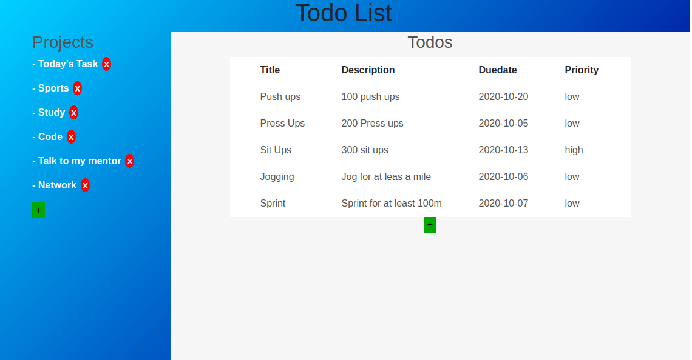

# Todo-list-js
This is a JavaScript To-Do list app where users can add projects and there corresponding task lists they like to work on.

# Project Specification

1. Your ‘todos’ are going to be objects that you’ll want to dynamically create, which means either using factories or constructors/classes to generate them.
2. Brainstorm what kind of properties your todo-items are going to have. At a minimum they should have a title, description, dueDate and priority. You might also want to include notes or even a checklist.
3. Your todo list should have projects or separate lists of todos. When a user first opens the app, there should be some sort of ‘default’ project to which all of their todos are put. Users should be able to create new projects and choose which project their todos go into.
4.You should separate your application logic (i.e. creating new todos, setting todos as complete, changing todo priority etc.) from the DOM-related stuff, so keep all of those things in separate modules.
5. The look of the User Interface is up to you, but it should be able to do the following:
    - view all projects
    - view all todos in each project (probably just the title and duedate.. perhaps changing color for different priorities)
    - expand a single todo to see/edit its details
    - delete a todo
6. Use localStorage to save user’s projects and todos between sessions.

## Built With

- HTML5
- CSS
- Bootstrap
- Javascript ES6
- webpack

## screenshots

### Index Page

## Getting Started

To get a local copy up and running follow these steps:

### Prerequisites

Mozilla Firefox

- Javascript enabled

### Usage

- Fork/Clone this project to your local machine with the command `git clone https://github.com/tGodson/Todo-list-js.git`
- `cd` into the project directory
- Double click on `index.html` in the `dist` folder to open the project in the browser
- To view in IDE just open project folder in your prefered IDE

## Author

👤 **Tendongze Godson**

- Github: [tGodson](https://github.com/tGodson)
- Twitter: [@tendongze95](https://twitter.com/tendongze95)
- Linkedin: [linkedin](https://www.linkedin.com/in/tendongzegodson)

👤 **Mark James Kiptubei**

- Github: [@kiptubei](https://github.com/kiptubei)
- Twitter: [@mjabei](https://twitter.com/mjabei)
- Linkedin: [Mark James Kiptubei](https://www.linkedin.com/in/kiptubei/)

## 🤝 Contributing

Contributions and feature requests are welcome!

Start by:

- Forking the project
- Clone the project to your local machine by running `https://github.com/tGodson/Todo-list-js.git`
- `cd` into the project directory
- Run `git checkout -b your-branch-name`
- Make your contributions
- Push your branch up to your forked repository
- Open a Pull Request with a detailed description to the development(or master if not available) branch of the original project for a review

## Show your support

Give a ⭐️ if you like this project!

## Acknowledgments
